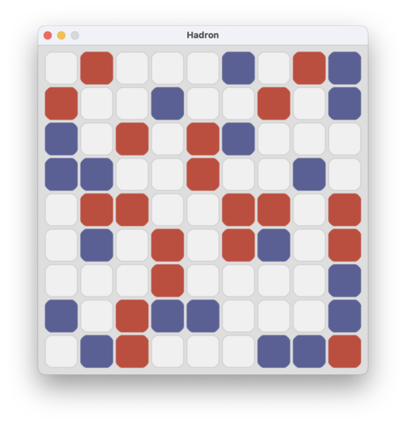

# **Hadron Game AI**

This is a game AI project for the course "Artificial Intelligence" at the University of Calabria, Italy.

I made this project with my colleague [**Pasquale Mirko Aprigliano**](https://github.com/PasqualeMirko).

The project consists in the implementation of a game AI for the game "Hadron" designed by 
**Mark Steere**, [**here**](https://www.marksteeregames.com/Hadron_rules.pdf) is the original rule paper. 
You can also find the rules in the root folder of the project, in the file **"Hadron_rules.pdf"**.

## Quick Hadron introduction:
Hadron is a two player game played on a 5x5 (or 7x7...) square board, initially empty.

The two players, Red and Blue, take turns adding their own tiles to the board, one tile per turn, starting with Red. 
If you have a placement available, you must make one. Passing is not allowed.
Draws cannot occur in Hadron

The game ends when one player has no more tiles to place. The player that play last wins.

No draws are possible in Hadron.

## How to run the project:
In the **_tests_** folder there are some files starts with **"test_"**, these are the test files, 
you can run them to test the project.

For example, if you want to play a game against the AI, you can run the file **"test_human_vs_ai.py"**.

## Project structure:

The project is structured in this way:

- **_hadron_** folder: contains the files _game.py_ and _board.py_ that are taken from 
the [aimacode](https://github.com/aimacode) GitHub repository.
There are also an implementation of the game **Hadron** in the file _hadron.py_ and the file _hadron_graphic_module.py_ 
contains the graphic implementation of the game with PyGame.

- **_tests_** folder: contains the test files that you can run at first.

- **_players_** folder: contains some player implementations, like the simplest **HumanPlayer** and the **RandomPlayer**.
In this folder are also two AI players, the **MonteCarloPlayer** and the **CarloAnalphabetaPlayer**.

- **_dql_** folder: contains the implementation of the **Deep Q-Learning** algorithm for the game Hadron.
But this implementation is not complete, it's just a test, so it doesn't work properly.

- **_search_algorithms.py_** file: contains the implementation of some search algorithms like **MinMax**, 
**AlphaBeta**, **MonteCarlo** and others. The implementations of these algorithms are taken from 
the [aimacode](https://github.com/aimacode) GitHub repository

## Carlo the analphabeta:
**CarloAnalphabeta**'s player is the best Hadron player that we've made. 
It uses a combination of the **AlphaBeta** search and  **MonteCarlo** search algorithms with some optimizations.
In the file _carlo_analphabeta_player.py_ you can find the implementation of this player.
This player makes a MonteCarlo search until the number of move still remains is greater than 6, then it uses the 
AlphaBeta search with a depth of 12 in combination with a heuristic function.

## Issues:
Feel free to open an _issue_.

## License:
This project is licensed under the terms of the MIT license.

---
#### Enjoy!

